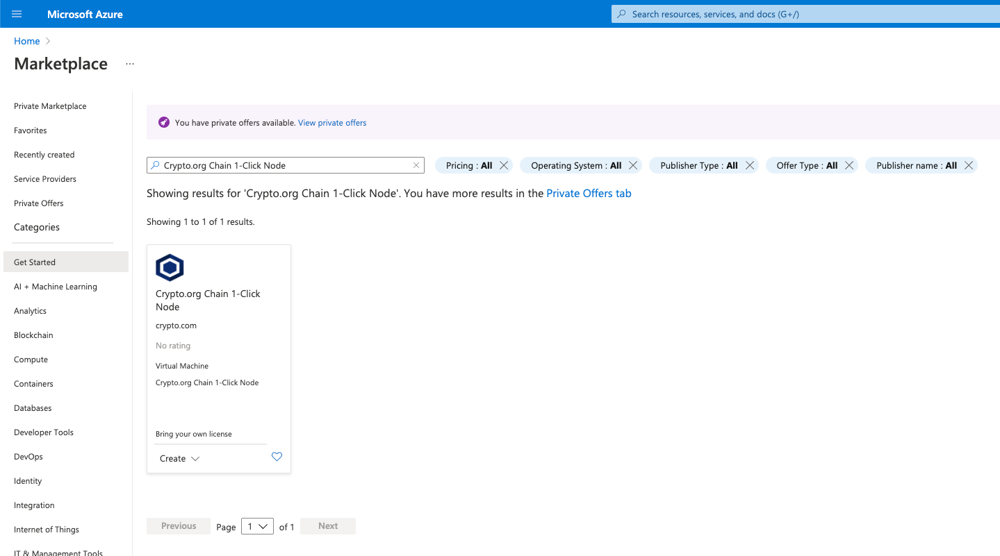
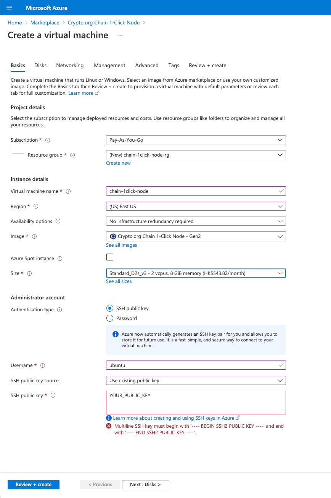

# Croeseid Testnet: Running Nodes using Azure 1-click Deployment

This tutorial will use our Azure 1-click Deployment image to start and create the latest Croeseid Testnet validator or full node.

## Step 1. Azure Account Creation

You will first need to create an [Microsoft Azure](https://azure.microsoft.com/) account with a `Pay-As-You-Go` subscription. This will require providing your credit card information to `Microsoft Azure` and you may be subject to charges when you create a virtual machine.

Please read `Microsoft Azure` free trial introduction to see if you are eligible for the free-tier.

## Step 2. Common Setup

### Step 2-1. Search for Crypto.com Chain on Marketplace

Sign in to your Microsoft Azure account and go to [Marketplace](https://portal.azure.com/#blade/Microsoft_Azure_Marketplace/MarketplaceOffersBlade/selectedMenuItemId/home). Search for "Crypto.com Chain Testnet Node".



### Step 2-2. Create a Virtual Machine

Choose the image and click "Create" to start creating the Crypto.com chain testnet node.

#### 1. Basic



| Configuration           | Value                                                                                                            |
| ----------------------- | ---------------------------------------------------------------------------------------------------------------- |
| _Size_                  | Select a recommended one or _DC2s_v3_                                                                            |
| _SSH public key source_ | Choose _"existing public key"_                                                                                   |
| _SSH public key_        | Copy and past your [SSH public key](https://docs.microsoft.com/azure/virtual-machines/linux/mac-create-ssh-keys) |
| _Resource group_        | We suggest to create a new and dedicated one so that you can easily manage resources attached to the instance    |

#### 2. Disk

- Follow default setting

#### 3. Networking


- _Virtual network_, _Subnet_, _Public IP_ and _NIC_: "Create new" if you don't have any in that region

#### 4. Management

- Follow default setting
- _Boot diagnostics_: default is "On". Set to "Off" if it is not required.

#### 5. Advanced

- Follow default setting

#### 6. Tags

- Create Tag if needed

#### 7. Review + Create

- Click "create" to create your instance

### Step 2-3. Connect to your instance

Once the deployment is completed, you can connect to your instance via SSH.

```
$ ssh ubuntu@PUBLIC_IP
```

Afterwards, go to the `chain` directory, and you will find all the essential binaries for setting up your node:

```bash
$ cd /chain/
$ ll
total 48
drwxr-xr-x  8 crypto crypto 4096 Dec 30 14:24 ./
drwxr-xr-x 20 root   root   4096 Jan  4 03:27 ../
drwxr-xr-x  4 crypto crypto 4096 Dec 30 14:24 .chain-maind/
drwxr-xr-x  5 crypto crypto 4096 Dec 30 14:23 .tmkms/
drwxr-xr-x  2 crypto crypto 4096 Dec 30 14:24 bin/
-rwxr-xr-x  1 crypto crypto  316 Dec 30 14:07 cleanForAMI.sh*
drwxr-xr-x  2   3434   3434 4096 Jun  4  2019 node_exporter-0.18.1.linux-amd64/
-rwxr-xr-x  1 crypto crypto 8891 Dec 30 14:06 reconfig.sh*
drwxr-xr-x  2 root   root   4096 Dec 30 14:06 release_binary/
drwxr-xr-x  2 crypto crypto 4096 Dec 30 14:22 sockets/
```

## Step 3. Running a full node

### Step 3-1. Use the reconfiguration script

Now we use the reconfiguration script `reconfig.sh` to choose the existing networks to join.

```bash
$ sudo -u crypto ./reconfig.sh

You can select the following networks to join
	0. testnet-croeseid-2
Please choose the network to join by index (0/1/...): 0
```

Clean up the old blockchain data (if any)
```bash
...
The selected network is testnet-croeseid-2
Reset chain-maind and remove data if any
❗️ Enter (Y/N) to confirm to delete any old data: Y
Stopping chain-maind tmkms service
INF Removed all blockchain history dir=/chain/.chain-maind/data
```

To join the network as a validator, the consensus public key is required. The consensus public key will be printed after generating tmkms signing key.

```bash
...
🧹 Remove old tmkms state
🔄 Regenerate tmkms consensus-ed25519 key 🔑
   Generated consensus (Ed25519) private key at: /chain/.tmkms/secrets/consensus-ed25519.key
🔄 Regenerate tmkms validator secret key 🔑
Restart tmkms service
🕑 Waiting for tmkms to run
✅ Please keep consensus public key for node join if it is validator or find it again in /chain/log/tmkms/tmkms.log. It will show again when restart tmkms in log

Consensus public key for node join: tcrocnclconspub1XXXXXXXXXXXXXXXXXXXXXXXXXXXXXXXXXXXXXXXXXXXXXXXXXXXXXXXXXXXXXXXXXX
```

The script will also ask you to fill in the `moniker` value which is a human readable display name for tendermint p2p.

```bash
Replace moniker in /chain/.tendermint/config/config.toml
Moniker is display name for tendermint p2p

moniker: YOUR_MONIKER_NAME
```

You may also enable [STATE-SYNC](https://docs.tendermint.com/master/tendermint-core/state-sync.html) to speed up the block syncing process.
_p2p gossip_ will allow you to connect with more nodes (data sources).

```bash
Do you want to enable state-sync? (Y/N): y
Do you want to add the public IP of this node for p2p gossip? (Y/N): y
✅ Added public IP to external_address in chain-maind config.toml for p2p gossip
```

_node_id_ and _node_key_ are the unique identity of your node. Save them for later use.

```
Generate and replace node_key in /chain/.chain-maind/config/node_key.json

You may want to save node_id and node_key for later use

node_id: 62cf74XXXXXXXXXXXXXXXXXXXXXXXXXXXXXXXXXX

node_key: LyQiGlL4HsdHsPXXXXXXXXXXXXXXXXXXXXXXXXXXXXXXXXXXXXXXXXXXXXXXXXXXXXXXXXXXXXXXXXXXXXXXXXXX
```

`chain-maind` is now running at the background as a systemd service.

You can check its log by the command `journalctl`, for example:

```bash
$ journalctl -u chain-maind.service -f
-- Logs begin at Wed 2020-12-30 13:51:25 UTC. --
Jan 04 03:53:14 chain-testnet-node chain-maind[9078]: 3:53AM INF Block{
Jan 04 03:53:14 chain-testnet-node chain-maind[9078]:   Header{
Jan 04 03:53:14 chain-testnet-node chain-maind[9078]:     Version:        {11 0}
Jan 04 03:53:14 chain-testnet-node chain-maind[9078]:     ChainID:        testnet-croeseid-2
Jan 04 03:53:14 chain-testnet-node chain-maind[9078]:     Height:         168760
Jan 04 03:53:14 chain-testnet-node chain-maind[9078]:     Time:           2021-01-04 03:52:59.280795943 +0000 UTC
Jan 04 03:53:14 chain-testnet-node chain-maind[9078]:     LastBlockID:    F41E759C17AE83DE912E772187C3E40D0D4FC381CF4284D5E19D848698C9C9A4:1:02AB71C44B20
Jan 04 03:53:14 chain-testnet-node chain-maind[9078]:     LastCommit:     065567AFC39DD6C88A9D8392BA8F33116504191F49FF897658B80B01499609F0
Jan 04 03:53:14 chain-testnet-node chain-maind[9078]:     Data:           F69577E54A82341E32ED89894501377088DC694A49C39FF98521089E812ACFAF
Jan 04 03:53:14 chain-testnet-node chain-maind[9078]:     Validators:     9D26665EC32458CCA3A9105C298506C9D54760EEA5F1F97B2E34C4260D8079D3
Jan 04 03:53:14 chain-testnet-node chain-maind[9078]:     NextValidators: 9D26665EC32458CCA3A9105C298506C9D54760EEA5F1F97B2E34C4260D8079D3
Jan 04 03:53:14 chain-testnet-node chain-maind[9078]:     App:            4C43CC41D2BD48FA42CA910D63D67D57AD819B0939AA36A54EAB352BEEF7783F
Jan 04 03:53:14 chain-testnet-node chain-maind[9078]:     Consensus:      048091BC7DDC283F77BFBF91D73C44DA58C3DF8A9CBC867405D8B7F3DAADA22F
Jan 04 03:53:14 chain-testnet-node chain-maind[9078]:     Results:        D32D3457E1FB8E3C773B7444D19905CFEB74B7C04CBC717B5D2C0D89B4613D36
Jan 04 03:53:14 chain-testnet-node chain-maind[9078]:     Evidence:       E3B0C44298FC1C149AFBF4C8996FB92427AE41E4649B934CA495991B7852B855
Jan 04 03:53:14 chain-testnet-node chain-maind[9078]:     Proposer:       703B26AEA0867B03572719D22F4B8E6D93CA838C
Jan 04 03:53:14 chain-testnet-node chain-maind[9078]:   }#9D6BA3E0D546EB9528822100ECF53B03B7258A757EA84982F5B08304E84E2954
Jan 04 03:53:14 chain-testnet-node chain-maind[9078]:   Data{
Jan 04 03:53:14 chain-testnet-node chain-maind[9078]:     A5C13EBB579079788A095C0CE4261B54F050D312BE043DCC1DE67E9DA9758C5C (329 bytes)
...
```

The latest block height can be found by:

```bash
$ curl -s https://testnet-croeseid.crypto.com:26657/block | jq -r .result.block.header.height
168783
```

Once the tendermint syncs to the latest block, the setup is done! You may move on to the next step if you want to join the network as a validator.

## Step 4. Join as a validator

We suggest that you should do this process locally with `chain-maind` to avoid exposing your keys on a cloud server.
If you haven't installed `chain-maind` yet, please follow [Step 1. Get the Crypto.com Chain binary](./croeseid-testnet.html#step-1-get-the-crypto-com-chain-binary).
:::tip NOTE

- Check whether your chain-maind is the testnet binary

```bash
$ chain-maind version
0.8.0-croeseid
```

- Testnet binary for
  [Mac](https://github.com/crypto-com/chain-main/releases/download/v0.8.1-croeseid/chain-main_0.8.1-croeseid_Darwin_x86_64.tar.gz) and [Windows](https://github.com/crypto-com/chain-main/releases/download/v0.8.1-croeseid/chain-main_0.8.1-croeseid_Windows_x86_64.zip) are also available.
  :::

### Step 4-1. Create a new key and address

Run the followings to create a new key. For example, you can create a key will the name `Default` by:

```bash
  $ chain-maind keys add Default
```

You should obtain an address with `tcro` prefix, e.g. `tcro1quw5r22pxy8znjtdkgqc65atrm3x5hg6vycm5n`. This will be the address for performing transactions.

### Step 4-2. Obtain test token

Unless you have obtained the CRO testnet token before, use the [CRO faucet](https://chain.crypto.com/faucet) to obtain test CRO tokens.
In case you have reached the daily limit on faucet airdrop, you can simply send a message on [Discord](https://discord.gg/pahqHz26q4),
stating who you are and your `tcro.....` address.

### Step 4-3. Running a validator node

```bash
$ chain-maind tx staking create-validator \
--from=[name_of_your_key] \
--amount=500000tcro \
--pubkey=[tcrocnclconspub...]  \
--moniker="[The_id_of_your_node]" \
--security-contact="[security contact email/contact method]" \
--chain-id="testnet-croeseid-2" \
--commission-rate="0.10" \
--commission-max-rate="0.20" \
--gas 800000 \
--commission-max-change-rate="0.01" \
--min-self-delegation="1" \
--gas-prices 0.1basetcro \
--node https://testnet-croeseid.crypto.com:26657

## Transactions payload##
{"body":{"messages":[{"@type":"/cosmos.staking.v1beta1.MsgCreateValidator"...}
confirm transaction before signing and broadcasting [y/N]: y
{"height":"545811","txhash":"89314DB8492B14EE35991A9880FF6C89B02FA04880EB33A2DADF25F419F0E59E","codespace":"",...}
```

You will be required to insert the following:

- `--from`: The `trco...` address or name of your key in [Step 4-1](#step-4-join-as-a-validator) that holds your funds;
- `--pubkey`: The consensus public key in [Step 3-1](#step-3-1-use-the-reconfiguration-script) with **tcrocnclconspub** as the prefix;
- `--moniker`: A moniker (name) for your validator node in [Step 4-1](#step-4-join-as-a-validator);
- `--security-contact`: Security contact email/contact method.

### Step 4-4. Check if the validator has been set

Now you can check if your validator has been added to the validator set:

```bash
# change tcrocnclconspub1.... to what you got from the Step 3-1
$ TM_PUBKEY=$(chain-maind debug pubkey tcrocnclconspub1zcjduepq8g83jlgycutqfsgc8e42x23ex6wgjzy5t46zl94ey0kunxm9zwcsuzkxpr 2>&1 \
| grep "tendermint/PubKeyEd25519" \
| cut -d : -f2- | jq -r .value)
$ chain-maind query tendermint-validator-set --node https://testnet-croeseid.crypto.com:26657 | grep -c $TM_PUBKEY
## 1 = Yes; 0 = Not yet added ##
```

To further check if the validator is signing blocks, kindly run this [script](https://github.com/crypto-com/chain-docs/blob/master/docs/getting-started/assets/signature_checking/check-validator-up.sh), for example:

```bash
# change tcrocnclconspub1.... to what you got from the Step 3-1
$ curl -sSL https://raw.githubusercontent.com/crypto-com/chain-docs/master/docs/getting-started/assets/signature_checking/check-validator-up.sh | bash -s -- \
--tendermint-url https://testnet-croeseid.crypto.com:26657 \
--bechpubkey tcrocnclconspub1zcjduepq8g83jlgycutqfsgc8e42x23ex6wgjzy5t46zl94ey0kunxm9zwcsuzkxpr

The validator is in the active validator set under the address  <YOUR_VALIDATOR_ADDRESS>
The validator is signing @ Block#<BLOCK_HEIGHT> 👍
```
Congratulations! You've successfully joined the network as a validator!
